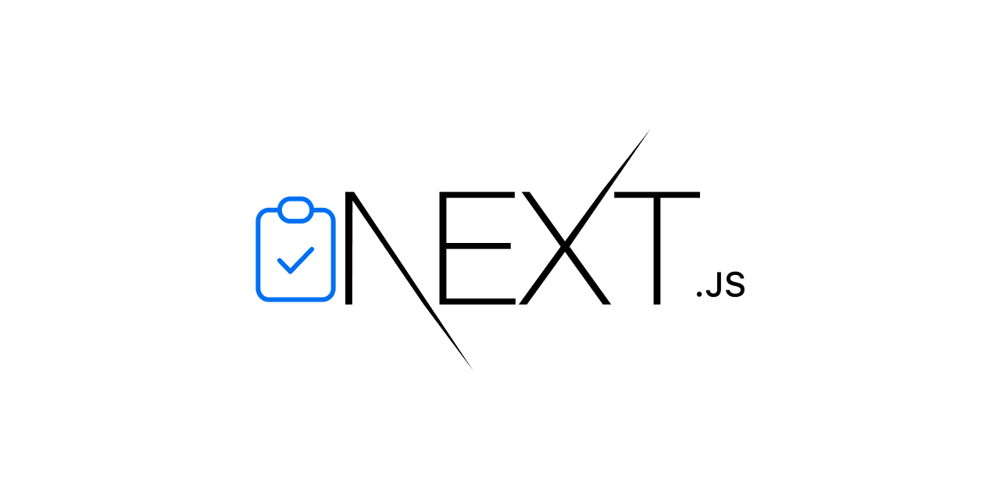

# 👨🏼‍💻 next saas

_A basic todo application built with [Next.js][next] and [Supabase][supabase]._

[![vercel][vercel-badge]][vercel]
[![github actions][github-actions-badge]][github-actions]
[![codecov][codecov-badge]][codecov]
[![contributing][contributing-badge]][contributing]
[![contributors][contributors-badge]][contributors]
[![discord][discord-badge]][discord]

    

## ✨ contributors

<!-- ALL-CONTRIBUTORS-LIST:START - Do not remove or modify this section -->
<!-- prettier-ignore-start -->
<!-- markdownlint-disable -->
<table>
  <tr>
    <td align="center"><a href="https://bradgarropy.com"> <b>Brad Garropy</b></a> <a href="https://github.com/bradgarropy/next-saas/commits?author=bradgarropy" title="Code">💻</a> <a href="#design-bradgarropy" title="Design">🎨</a> <a href="https://github.com/bradgarropy/next-saas/commits?author=bradgarropy" title="Documentation">📖</a> <a href="#infra-bradgarropy" title="Infrastructure (Hosting, Build-Tools, etc)">🚇</a> <a href="https://github.com/bradgarropy/next-saas/commits?author=bradgarropy" title="Tests">⚠️</a></td>
  </tr>
</table>

<!-- markdownlint-restore -->
<!-- prettier-ignore-end -->

<!-- ALL-CONTRIBUTORS-LIST:END -->

[next]: https://nextjs.org
[supabase]: https://supabase.com
[vercel]: https://vercel.com/bradgarropy/next-saas
[vercel-badge]: https://img.shields.io/github/deployments/bradgarropy/next-saas/production?label=vercel&style=flat-square
[github-actions]: https://github.com/bradgarropy/next-saas/actions
[github-actions-badge]: https://img.shields.io/github/workflow/status/bradgarropy/next-saas/%F0%9F%A7%AA%20test?style=flat-square
[codecov]: https://app.codecov.io/gh/bradgarropy/next-saas
[codecov-badge]: https://img.shields.io/codecov/c/github/bradgarropy/next-saas?style=flat-square
[contributing]: https://github.com/bradgarropy/next-saas/blob/master/contributing.md
[contributing-badge]: https://img.shields.io/badge/PRs-welcome-success?style=flat-square
[contributors]: #-Contributors
[contributors-badge]: https://img.shields.io/github/all-contributors/bradgarropy/next-saas?style=flat-square
[discord]: https://bradgarropy.com/discord
[discord-badge]: https://img.shields.io/discord/748196643140010015?style=flat-square
